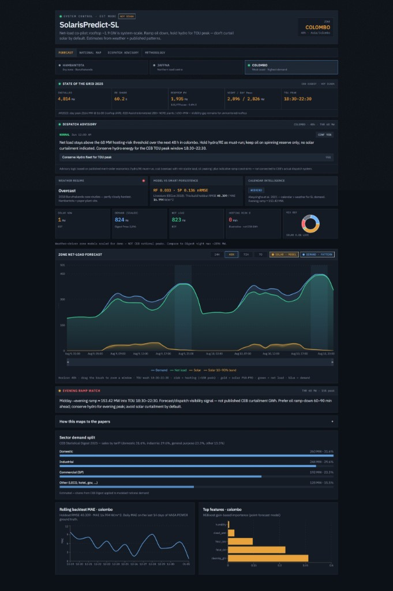
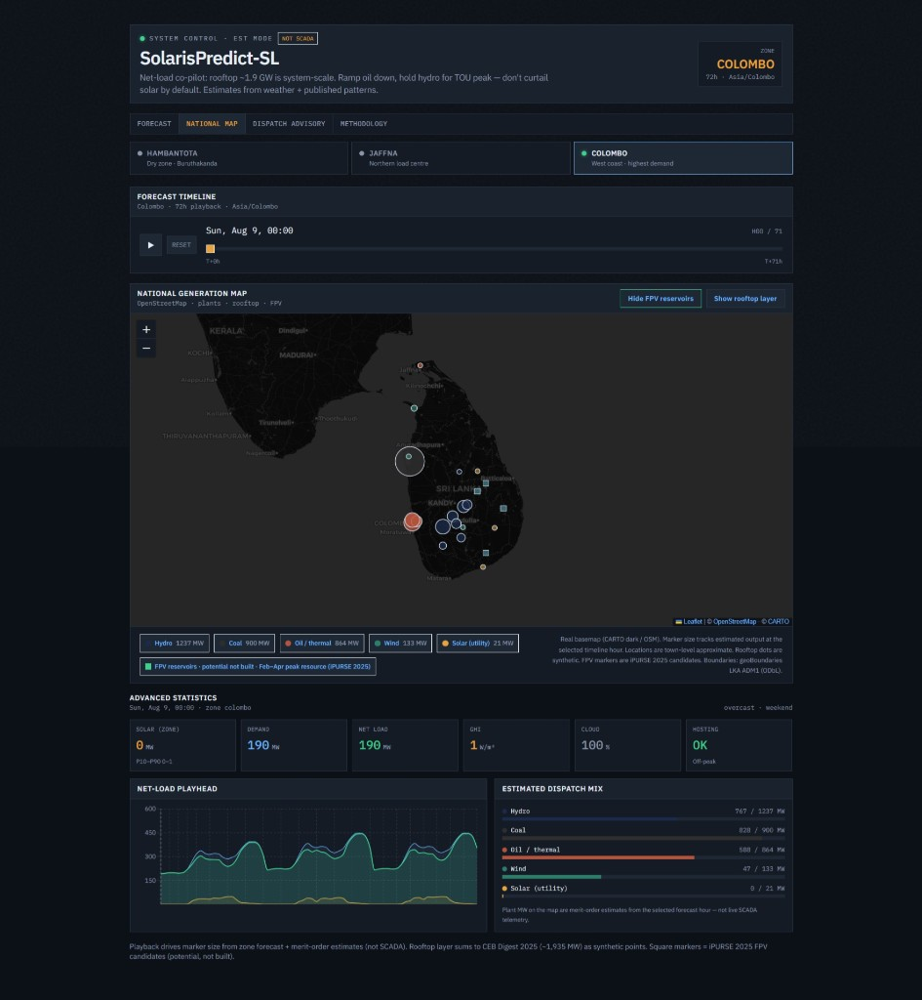

# SolarisPredict-SL

> **An AI-powered grid digital twin for Sri Lanka providing weather-driven national net-load forecasts and dispatch intelligence to optimize renewable integration.**


Rooftop solar is already system-scale (~1.9 GW). Operators need to see **demand − solar** hours ahead — not solar or load alone — so they can ramp oil down, hold hydro for the evening TOU peak, and avoid curtailing solar by default.

SolarisPredict-SL combines zone forecasts, a national plant map with time playback, and a merit-order **dispatch advisory**. Estimates come from live weather plus published demand patterns. Labeled **EST mode / NOT SCADA** on purpose.

---

## 🌟 Value Proposition

- **Prevents Renewable Curtailment:** By accurately forecasting net-load, grid operators can proactively stage flexible thermal and hydro generation, minimizing unnecessary solar and wind curtailment.
- **Reduces Operational Risk:** Provides clear, actionable dispatch advisories (e.g., when to hold hydro reserves or spin up fast thermal plants) hours ahead of critical ramps.
- **Enhances Grid Visibility:** Consolidates disparate weather data, estimated rooftop solar capacity, and regional demand into a single, cohesive national dashboard.
- **Cost Efficiency:** Optimizing the generation mix and reducing reliance on expensive peaker plants during non-critical hours lowers overall operational costs.
- **Accelerates Green Transition:** Builds confidence in handling higher penetrations of variable renewable energy (VRE) by providing data-driven operational intelligence.

---

## 📸 Screenshots

### Forecast & dispatch advisory

Zone net-load chart, net-load risk context, and operator-facing recommendations for Colombo, Hambantota, and Jaffna.



### National map

Animated national generation view — hydro, coal, oil/thermal, wind, utility solar — with optional rooftop layer and estimated dispatch mix.



---

## 💡 Why this exists

In February 2025, Sri Lanka’s grid faced a blackout when solar was meeting over half of national demand. Curtailment later spread beyond “Sunny Sundays.” The operational bottleneck is visibility: without a **net-load** forecast, flexible thermal and hydro cannot be staged early enough, so solar gets cut.

Academic work here typically forecasts solar *or* demand. This project forecasts them **together** and turns the result into a recommended action.

---

## 📦 What you get

| Surface | Purpose |
|---------|---------|
| **Forecast** | Solar, demand, and net load on one timeline (24h–7D), with a solar uncertainty band and net-load risk threshold |
| **Dispatch advisory** | Merit-order guidance: flex oil first, hold coal at minimum stable, conserve hydro for TOU peak (18:30–22:30), keep solar must-run when net load allows |
| **National map** | Plant markers by fuel type, timeline playback tied to zone forecasts, illustrative rooftop layer (~1,935 MW), FPV candidate sites |
| **Methodology** | Sources, model choice, and explicit limits of the estimate |

**Zones:** Hambantota (dry zone / Buruthakanda), Jaffna (northern load), Colombo (highest demand / wet-zone cloud volatility).

---

## 🏗️ Architecture

```
┌──────────────────────────┐         HTTPS / JSON        ┌────────────────────────────┐
│  solaris-frontend        │ ──────────────────────────▶ │  solaris-backend           │
│  Next.js 14 + TypeScript │ ◀────────────────────────── │  FastAPI (port 7860)       │
│  Recharts · Leaflet map  │                             │  XGBoost solar models      │
│  Vercel-ready            │                             │  Rule-based demand engine  │
└──────────────────────────┘                             └─────────────┬──────────────┘
                                                                       │
                                                         ┌─────────────▼──────────────┐
                                                         │ NASA POWER (train)         │
                                                         │ Open-Meteo (live forecast) │
                                                         └────────────────────────────┘
```

Optional: `solaris-demo` — 90s Remotion pitch video for competition demos ([DEMO.md](DEMO.md)).

---

## 🚀 Quick start

### 1. Backend

```bash
cd solaris-backend
py -m venv .venv
.venv\Scripts\activate          # macOS/Linux: source .venv/bin/activate
py -m pip install -r requirements.txt

# Optional — pull NASA POWER history and retrain zone models
py -m app.data_pipeline
py -m app.train_solar_model

py -m uvicorn app.main:app --reload --host 0.0.0.0 --port 7860
```

API docs: [http://localhost:7860/docs](http://localhost:7860/docs)

### 2. Frontend

```bash
cd solaris-frontend
cp .env.local.example .env.local   # NEXT_PUBLIC_API_URL=http://localhost:7860
npm install
npm run dev
```

Open [http://localhost:3000](http://localhost:3000).

### 3. Pitch video (optional)

```bash
cd solaris-demo
npm install
npm run dev          # Remotion Studio → composition SolarisPitch
```

---

## 🧰 Tech Stack (Detailed)

- **Frontend:** Next.js 14, React, TypeScript, TailwindCSS, Recharts, Leaflet / react-simple-maps  
- **Backend:** Python, FastAPI, Uvicorn, XGBoost, scikit-learn, pandas, numpy  
- **Data Integrations:** NASA POWER API, Open-Meteo API (no API key required)  
- **Demo Video:** Remotion  

---

## 📡 API (backend)

| Endpoint | Description |
|----------|-------------|
| `GET /health` | Liveness + supported zones |
| `GET /forecast/solar?zone=&hours=48` | Hourly GHI / solar MW from Open-Meteo + XGBoost |
| `GET /forecast/netload?zone=&hours=48` | Solar + demand → net load and net-load / curtailment signals |
| `GET /backtest?zone=` | Holdout RMSE / MAE from the last training run |

Zones: `hambantota` · `jaffna` · `colombo` · `hours` 1–168.

---

## 🧠 Models & data

| Piece | Approach |
|-------|----------|
| **Solar** | Per-zone XGBoost on NASA POWER history; live drive from Open-Meteo radiation / cloud / temp |
| **Demand** | Illustrative Sri Lanka load curve — weekday / weekend / Poya / New Year multipliers from published patterns |
| **Net load** | `demand − solar`, with a net-load risk band when the midday dip gets dangerous |
| **Dispatch** | Merit-order rules + confidence — not live CEB SCADA |

**Honesty label:** demand is calendar-pattern-based, not live CEB telemetry. Rooftop points are a synthetic national distribution from published capacity — not individual GPS addresses. Square markers on the map include potential iPURSE 2025 FPV candidates that may not be built yet.

---

## 📂 Repository layout

```
AI Challenge/
├── solaris-backend/     # FastAPI + XGBoost + demand engine
├── solaris-frontend/    # Next.js dashboard
├── solaris-demo/        # Remotion 90s pitch
├── docs/screenshots/    # README images
├── DEMO.md              # 5-minute live demo script
└── README.md
```

More detail: [solaris-backend/README.md](solaris-backend/README.md) · [solaris-frontend/README.md](solaris-frontend/README.md) · [solaris-demo/README.md](solaris-demo/README.md)

---

## 🎬 Demo tip

See [DEMO.md](DEMO.md) for a timed walkthrough. Start on **Forecast** → point at the advisory → play **National Map** → land on **Methodology** for sources. Lead with EST / NOT SCADA so judges trust the method.
